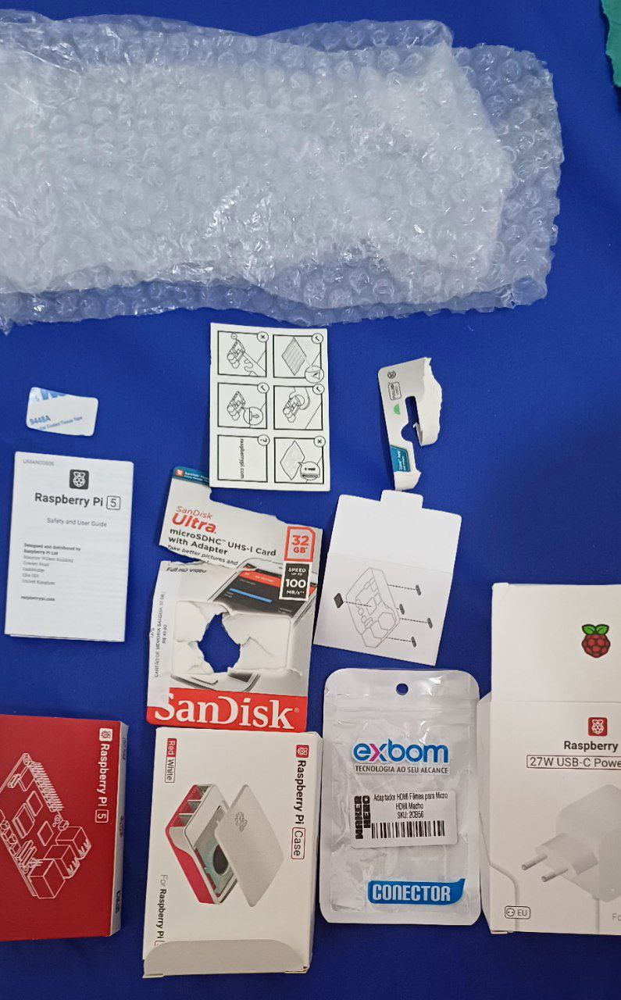
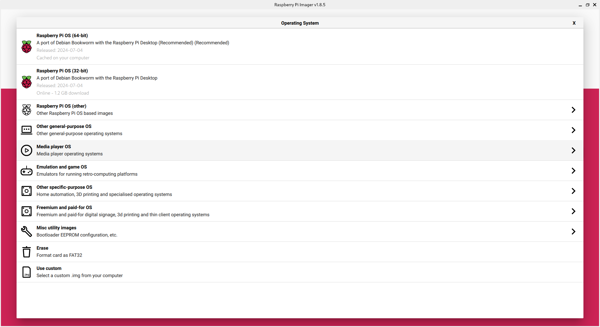
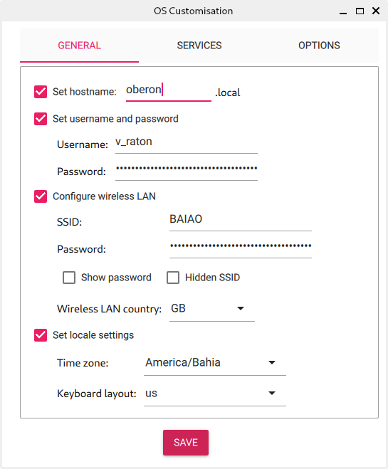
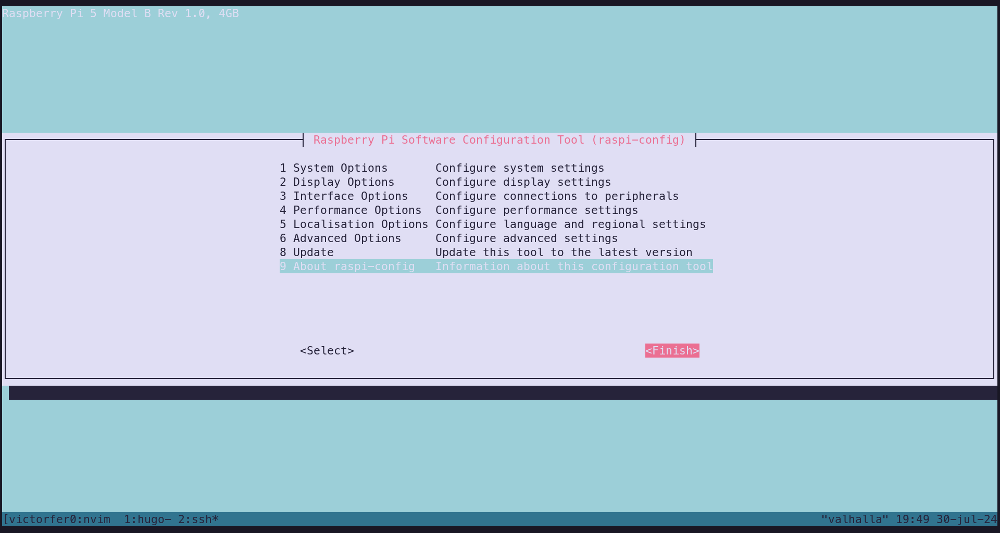
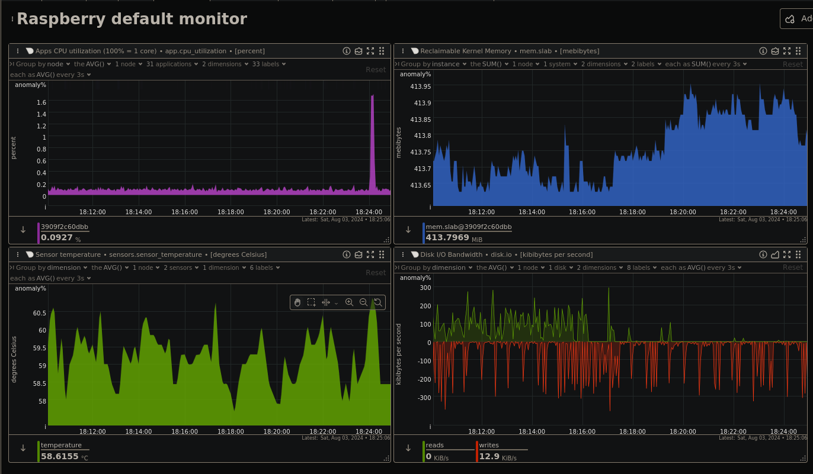

+++
title = 'LLM para coisas pequenas'
date = 2024-07-13T13:30:48-03:00
draft = false
description = 'Usando modelos LLM em um Raspberry Pi 5 com apenas 4GB de RAM' 
tags = ['os' , 'raspberry', 'debian', 'casaos', 'llm', 'ollama']
cover = 'cover.jpg'
+++

# Voltando a um mês na maquina do tempo

Era uma noite de um sabado ou domingo quaisquer, estava fazendo vãrios nadas e pensando como gastar uma grana que eu tinha sobrando. As opções eram:
- Doar pra um projeto open source
- Fazer certificação AWS
- Comprar um raspberry pi 5 e testar

Como não tenho me deparado com nenhum projeto em especial para doar, e pensei melhor em fazer certificação AWS em outro momento da minha carreira, entâo decidi ir com tudo e fazer algo que eu estava com saudades, afinal tinha vendido meu precioso raspberry Pi 3 a uns anos quando desisti da carreira de IOT.

Sem mais delongas entrei no site do [MakerHero]() o velho companheiro de compra de ESP32 e decidi comprar um kit de raspberry pi 5 pra testar e um esp32 pra futuros projetos....

# Montagem

A primeira impressão que tenho é que tanto a case oficial do Pi5 quanto o próprio resolveram dois problemas pra min , que possuo baixa visão e mãos grandes.

O primeiro deeles são os encaixes da case , simples de vizualizar, bem como o conector de FAN que desta vez nôo ocasionei o acidente de quebrar. Curiosamente meu case veio sem os parafusos de encaixe que vi em alguns reviews no yt antes da compra, mas consegui colocar tudo sem eles, apesar do risco de vibração a longo prazo ou de um queda sair desmanchando tudo...

O segundo problema que eles resolveram foi a conexão do microSD,nas versões antetiores que eu tinha o encaixe era muito "duro" , inviabilizando swap de cartão SD, hoje, mesmo com o case consigo remover o microSD sem grandes dores de cabeça


# Muito lixo

O primeiro ponto negativo é a quantidade de papel e papelão gerada, sério todo raspberry vai precisar de pelo menos cooler, microSD e  cabo HDMI, e poderiam fazer um package já com a fonte junta, olha a quantidade de caixinhas que tenho aqui que irão pro lixo , pois em Salvador , reciclagem é uma grande mentira.



# Fazendo instalação e conexão ssh.

Ao entrar no site do raspberry basta baixar o software para debian e instalar o aplicativo .deb , 

Após isso eu gerei uma imagenm no microSD com o sistema em modo light, mas se essa for sua primeira vez , sugiro que escolha a opção recomendada



Defini uns parâmetros para poder fazer ssh mais tarde, como nome do device e do usuário (serão usados mais tarde, fique atento), assim eu renomeei meu device para oberon.local, dessa forma ele ficaria indicado na minha rede como oberon, tanbém defini a conexão do meu wifi com senha pra não ter o trabalho de cabear e habilitei a conexão ssh, onde precisarei ter definido a senha do usuário root que criei como v_raton.



Curioso que esse instalador já define o datetime e o tipo de teclado , que no meu caso é americano, isso é importante para que ele não defina o sistema em pt-br o que seria um grande incomodo.

Eu defini o login de ssh por meio da senha do usuário, mas pode ser feito por meio de uma chave de criptografia , como mostra as opções abaixo


# Achando o dito cujo

Sabendo que meu brinquedo está conectado à minha rede wifi, e que eu sei o nome dele, basta descobrir o IP que foi a este atribuido, como estamos entre usuários linux, vou pular a explicação de como usar o comando ping para achar meu dito cujo, mas com o endereço IP (no meu caso 192.168.68.109) eu consigo usar o ssh para se conectar a ele, uma dica tanbém é reomver o endereço IP dos know_hosts com o comando abaixo: 
```bash
ssh-keygen -R 192.168.68.109
```

Dai ao usar o comando de conexão ssh:

```bash
ssh v_raton@192.168.68.109

```

Ele vai ter o pompt de adicionar esta conexão em know_hosts com uma chave de criptografia que eu ocultei, basta digitar `y` e apertar enter

```bash
The authenticity of host '192.168.68.109 (192.168.68.109)' can't be established.
ED25519 key fingerprint is  <<BULSHIT>>
This key is not known by any other names.
Are you sure you want to continue connecting (yes/no/[fingerprint])?

```

Em seguida digite a senha que você estabeleceu pro usuário lá no inicio na configuração de sistema operacional, por fim use o comando `whoami` e `uname`

# Matenha seu SO atualizado

Como nosso novo brinquedo está usando um Debian, eu poderia usar apt-get para atualizar nosso sistema, mas vou aproveitar e apresentar o utilitário `raspi-config`, uma ferramenta que como o nome já evidencia, te ajuda a configurar o seu RPI.

Neste caso o comando é `sudo raspi-config` ele vai te levar pra um prompt no terminal, para sair basta ir na opção de update, não se assuste, mas apenas seu teclado funciona aqui , e para sair basta usar o ESC




Com seu sistema atualizado basta instalar o [Ollama](https://ollama.com/), uma ferramenta para gerenciar modelos e ferramentas de LLM, com ela é bem fácil procurar, instalar e testar LLM's locais, inclusive, uma boa forma de ter seus LLM privados , ainda mais se tiver um setup parrudo para tal.

Porém aqui a idéia é usar o "Pior setup possivél" para saber se existe um LLM interessante em condicões tão limitadas

# AVISO

A partir daqui eu estou confiando na credibilidade de um projeto open source , rodando modelos de LLM de terceiros, não posso garantir veracidade ou que estes modelos são seguros, portanto, SIGA POR SUA CONTA E RISCO.

# O tal do ollama

Não vou te poupar o trabalho de ver o guia de download recomendado e de ler o help do cli do ollama, basta seguir o guia de instalação para linux [neste link](https://ollama.com/download/linux), recomendo executar o comando como sudo

Pesquisando por essa plataforma não muito amigavél, conseguimos encontrar os modelos, mas aqui vai uma questão: Não tem filtro na UI padrão para buscar por tamanho de modelo ou requisitos , ou sequer outras características como idiomas usados nos treinamentos, fica a dica pra o pessoal do projeto.

Os modelos usados serão o tinyllama, o qwen2:0.5b , como não consegui fazer o app  do ollama funcionar a partir do meu homelab, decidi criar um script local e rodar ele da minha máquina host, afinal queremos testar tanbém o comportamento geral quando usado recursos de rede.

Para rodar nosso servidor com o ollama já instalado , mude a variavél de anbiente `OLLAMA_HOST` para o servidor local usando alguma porta para não dar conflito com o ssh, nesse caso eu usei o valor `OLLAMA_HOST=http://0.0.0.0:8080`, como já foi dito, o raspberry trata-se de um Debian, basta ajustar essa variavél de anbiente em `.bashrc` adicionando o seguinte conteúdo:

```bash
export OLLAMA_HOST=http://0.0.0.0:8080
```

Por fim basta usar o comando `source ~/.bashrc`

Ao usar o coamndo `ollama` será exibido os comandos disponivéis, por hora vamos baixar os modelos que precisamos por meio do comando `pull`

```bash
ollama pull qwen2:0.5b && ollama pull tinyllama && ollama pull tinydolphin
```

Para testar se esta tudo correto basta executar o comando `ollama run qwen2:0.5b` e `ollama run tinyllama`, tanbém temos o comando `ollama ps` para listar os modelos baixados

# Rodando o servidor

Como nesse caso estou usando o CasaOS , eu poderia ter algum container para o ollama configurado, algo que irei trabalhar nos próximos dias, mas por hora vamos apenas ligar o servidor e usar uma ferramenta do CasaOS para medir o uso de recurso, a ferramenta adotada é o [Netdata](https://learn.netdata.cloud/), uma ferramenta de monitoramento que achei perdida no CasaOS, ela possui integração com coisas como o Prometheus , mas isso é informação para um outro vídeo

Portanto vamos apenas iniciar o servidor e fazer um teste com um cURL para saber o comportamento do nossos modelos quanto a uso de recursos, portanto iremos iniciar o comando abaixo

```bash
ollama serve &
```

usando o `&` para rodar em background por meio da api de jobs do bash , e usaremos a requisição cURL abaixo para que os modelos do qwen e do tinillama nos respondam a uma simples pergunta: "O que é 42"

```bash
# Request tinillama
curl http://localhost:8080/api/generate -d '{
  "model": "tinyllama",
  "stream": false,
  "prompt": "O que é 42?"
}'

# Request qwen2
curl http://localhost:8080/api/generate -d '{
  "model": "qwen2:0.5b",
  "stream": false,
  "prompt": "O que é 42?"
}'

```

Obtivemos uma saida meio estranha, mas ao menos alguma resposta:

```bash
[GIN] 2024/08/03 - 14:35:00 | 200 | 13.736758128s |       127.0.0.1 | POST     "/api/generate"
{"model":"tinyllama","created_at":"2024-08-03T17:35:00.791324086Z","response":"42 (pronounced \"four-twenty\") es un número natural de la serie del octavo millón, cuyo valor de suma es 369 + 27 = 42. Es una frase popular que se usa para expresar el número 42 como una cantidad indefinida o extraño.","done":true,"done_reason":"stop","context":[529,29989,5205,29989,29958,13,3492,526,263,8444,319,29902,20255,29889,2,29871,13,29966,29989,1792,29989,29958,13,29949,712,904,29871,29946,29906,29973,2,29871,13,29966,29989,465,22137,29989,29958,13,29946,29906,313,771,22897,17608,287,376,17823,29899,7516,6478,1159,831,443,13831,5613,316,425,7080,628,4725,27082,3533,888,29892,2723,9029,16497,316,2533,29874,831,29871,29941,29953,29929,718,29871,29906,29955,353,29871,29946,29906,29889,3423,1185,5227,344,5972,712,409,502,29874,1702,29150,279,560,13831,29871,29946,29906,1986,1185,5107,2368,5704,4951,1458,288,4805,8266,29889],"total_duration":13693749560,"load_duration":5805827534,"prompt_eval_count":41,"prompt_eval_duration":2406601000,"eval_count":74,"eval_duration":5437933000}v
```

O ollama sempre responde informações sobre o modelo e o tempo de duração e evaluation, o que é interessante para nosso benchmark

Podemos saber mais sobre a api do ollama [aqui](https://github.com/ollama/ollama/blob/main/docs/api.md)


# Escrevendo um benchmark simples

Agora que temos uma ferramenta de monitoramento, o nosso servidor ollama funcionando, precisamos avaliar nosso benchmark do qwen2 vs tinyllama vs tinydolphin


Pensei em criar um script que faça a execução de 3 perguntas complicadas

- Uma pergunta sobre min , que o chatgpt consegue responder
- Pedir para desenvolver um programa em python que usa a lib request e query params
- Perguntar a resposta de uma operação de um polinômio ("Dado o polinômio P(x)=3x^3−5x^2+2x−7P. qual é o valor de P(2)?")

O nosso código ficou mais ou menos assim:

```python
import logging
import httpx
import pandas as pd
import time
import datetime

DOMAIN = "http://192.168.68.109:8080/api"
client = httpx.Client(timeout=1 * 60 * 60)
logger = logging.getLogger(__name__)
logging.basicConfig(encoding="utf-8", level=logging.INFO)


def get_models():
    r = client.get(f"{DOMAIN}/tags")
    r.raise_for_status()
    return r.json()["models"]


def make_question(question, model):
    r = client.post(
        f"{DOMAIN}/generate",
        json={"prompt": question, "model": model, "stream": False},
    )
    r.raise_for_status()
    return r.json()


if __name__ == "__main__":
    result = []
    df = pd.DataFrame()
    questions = [
        "Who is Victor Fernandes Baião Raton?",
        "Implement a python script who using requests lib and pass page as query params, also using Bearer token in request",
        "Dado o polinômio P(x)=3x3−5x2+2x−7P(x)=3x3−5x2+2x−7, qual é o valor de P(2)P(2)?",
    ]
    models = get_models()
    logger.info(models)
    for model in models:
        for question in questions:
            logger.info(model)
            start = time.perf_counter()
            response = make_question(question, model["name"])
            end = time.perf_counter()
            result.append(
                {
                    "model": model["name"],
                    "question": question,
                    "start": start,
                    "end": end,
                    "response": response["response"],
                    "duration": end - start,
                    "total_duration": response["total_duration"],
                    "prompt_eval_duration": response["prompt_eval_duration"],
                }
            )
            logger.info(f"duration {model} {question} {end - start}")
            logger.info(response["response"])

    df = pd.DataFrame(result)
    df.to_csv(
        f"output-{datetime.datetime.now().strftime('%Y-%m-%d-%H-%M-%S')}.csv",
        index=False,
    )

```

# Resultados

Primeiro vamos estabelecer o nosso "controle", fazendo as perguntas ao chatgpt 4o mini em janela anônima sem estar logado eu obtive os seguintes resultados para nossas perguntas:


## Who is Victor Fernandes Baião Raton?

```markdown

As of my last update in August 2024, there isn't widely available or notable information about a person named Victor Fernandes Baião Raton. It’s possible that he could be a private individual or a figure not widely covered in public sources.

If you have specific context about him—such as a field he might be associated with, or any relevant details—it could help in providing more tailored information. If this person has gained prominence or relevance recently, I might not have the latest updates.
```


## Implement a python script who using requests lib and pass page as query params, also using Bearer token in request

```markdown
Certainly! To create a Python script using the `requests` library that passes a page number as a query parameter and includes a Bearer token in the request, follow these steps:

1. **Install the `requests` library** (if you haven't already). You can install it using pip:
    pip install requests

2. **Create a Python script** that performs the HTTP request with the specified query parameters and Bearer token.

Here’s a sample script to demonstrate how to achieve this:

    import requests

    def fetch_data(url, page, bearer_token):
        # Define the headers with the Bearer token
        headers = {
            'Authorization': f'Bearer {bearer_token}'
        }
        
        # Define the query parameters
        params = {
            'page': page
        }
        
        # Make the GET request
        response = requests.get(url, headers=headers, params=params)
        
        # Check if the request was successful
        if response.status_code == 200:
            return response.json()  # or response.text for raw text
        else:
            print(f'Error: {response.status_code}')
            return None

    # Example usage
    if __name__ == "__main__":
        url = 'https://api.example.com/data'  # Replace with your API URL
        page = 1  # Replace with your desired page number
        bearer_token = 'your_bearer_token_here'  # Replace with your actual Bearer token
        
        data = fetch_data(url, page, bearer_token)
        
        if data:
            print(data)

### Explanation:

1. **Imports**: We import the `requests` library.
2. **Function `fetch_data`**: This function takes `url`, `page`, and `bearer_token` as parameters.
   - **Headers**: We set the `Authorization` header with the Bearer token.
   - **Params**: We set the query parameter for the page number.
   - **Request**: We use `requests.get` to make a GET request with the provided URL, headers, and parameters.
   - **Response Handling**: We check the response status code and return the JSON data if the request is successful. Otherwise, we print an error message.
3. **Example Usage**: We demonstrate how to call the `fetch_data` function with a sample URL, page number, and Bearer token.

Replace `'https://api.example.com/data'` with your actual API endpoint, and `'your_bearer_token_here'` with your actual Bearer token. Adjust the `page` variable as needed for your query.

```


## Dado o polinômio P(x)=3x3−5x2+2x−7P(x)=3x3−5x2+2x−7, qual é o valor de P(2)P(2)?

```markdown
Para encontrar o valor de `P(2)` para o polinômio P(x) = 3x^3 - 5x^2 + 2x - 7, basta substituir  x por 2 na expressão do polinômio e calcular.

Vamos fazer isso passo a passo:

1. Substitua (x) por 2:
   P(2) = 3(2)³ - 5(2)² + 2(2) - 7

2. Calcule cada termo separadamente:
   2³ = 8 implies 3 times 8 = 24
   2² = 4 implies 5 times 4 = 20
   2 times 2 = 4

3. Substitua e simplifique:
   P(2) = 24 - 20 + 4 - 7
   P(2) = 4 + 4 - 7
   P(2) = 8 - 7
   P(2) = 1

Portanto, o valor de P(2) é 1.
```

Agora sem mais delongas vamos executar o nosso script , a fins de registro esses são os valores de uso de recurso do dispositivo em idle:



- CPU: 0.09%
- RAM: 413MB
- TEMP: 56°C
- DISK_READ: 0KB/s
- DISK_WRITE: 12.9KB/s


Agora vamos rodar nosso script, os primeiros picos serão do tinydolphin e o segundo será o uso do qwen2 , por fim a execução do tinyllama

# Picos de CPU

A primeira coisa que podemos notar é que o tempo de execução do qwen foi bem mais curto, mesmo repetindo esse teste algumas vezes, o qwen2 sempre apresenta uma média de execução menor.

Outro ponto curioso é que em ambos os casos temos um pico de leitura de disco sempre que se inicia a primeira chamada ao modelo, então talvez em algum projeto de LLM compsense ter algum tipo de warnup para evitar isso em produção...

O uso de memória achei curioso pois sempre ficava no topo, mas acredito ter algum tipo de problema na configuração desse raspberry pois o swap está sempre alocado no máximo, terei de investigar depois.


Por fim parece que o qwen2 é um modelo mais econômico em termos de recurso, mas acredito que isso seja por causa da opção de parâmetros com 0.5 Bilhões. O mais curioso é que aparentemente apenas o qwen e o qwen2 que possuem esses modelos bem pequenos, o tinyllama e o tinydolphin usam 1.1B de parâmetros.

No final tivemos como máximas em determinados momentos algo como:

- CPU: 98%
- RAM: 3GB
- TEMP: 73°C
- DISK_READ: 80MB/s
- DISK_WRITE: 0.21MB/s

O mais impressionante pra min foi ter conseguido "Topar a CPU" mas o cooler da case padrão manteve a temperatura bem regular, arquitetura ARM de fato é bem eficiente


# Analisando os resultados

Após olhar os dados gerados pelo nosso script [aqui](./output.csv), chegamos ás seguintes definições

- O tinydolphin e tinyllama tiveram desmpenhos melhores, mas o tinyllama se destacou em gerar o código em menor tempo, cerca de 32s , se comparado com 57s do tinydolphin, além disso o tinyllama respondeu de forma mais sucinta, o tinydolphin alucionou um pouco mais adicionando coisas desnecessárias no código gerado.

- O códgio gerado pelo qwen2 simplesmente inseriu termos em chinês do absoluto nada, acredito que neste caso a limitação de parâmetros somado com o possivél tipo de treinamento deste modelo piorou o resultado.

- Para o polinômio nenhum deles acertou, todos eles foram por caminhos diferentes, acredito que os sinais de exponenciais por não poderem ser representados não foram bem interpretados

- O dolphin se provou o menos eficiente, gastando mais recurso e mais tempo, mas nada  muito distante do tinyllama, porém no único resultado que o tinyllama acertou tivemos uma diferença de 32s para 57 segundos entre o tempo usado pelo tinyllama e o tinydolphin.

- Fato curioso é que nenhum deles acertou alguma informação sobre min quando perguntado, apenas alucinaram com respostas esquisitas, desde atleta, jogador de futebol e direitor de filme brasileiro(?) responsavél pela produção "The enchanted Island".

- Aparentemente os modelos rodaram sem fazer buscas na internet , não vi uso suspeito de rede nos diagramas

# Conclusão

Modelos de LLM para dispositivos pequenos são relativammente inuteis para geração de texto, para cálculos complexos, mas são aparentemente interessantes para coisas como gerar código, pelo menos o tinyllama.

Questões de memória RAM me limitaram a usar modelos melhores como o qwen:1.5b e o gemma:2b, ,mas acredito que esses modelos produzam um homelab interesante caso tenha 8gb de RAM, mas acredito que isso se limite a cenários mais específicos como processamento de imagem em sistemas CFTV ou locais com condições remotas de energia e internet. No final não vale a pena usar o raspberry para esse tipo de teste, talvez um PC "Gamer" consiga manter alguns modelos menores para ter um GPT local mais "burrinho".

Monitorar o Raspberry foi bem complicado, essa ferramenta de monitoramento que achei perdida no ecosistema do CasaOS veio a calhar, e tem coisas bem interessantes como a possibilidade de exportar para o Prometheus ou uma base de dados, fora que dá pra gerar gráficos customizados com base nos recursos padrões.

Por hoje é só e fico por aqui tentando pensar em um outro projeto pra um Raspberry de 4GB de RAM, mesmo o modelo com 8GB de RAM , não é legal pra brincar com IA como eu pensei que seria que fosse, mas fica um mérito ao cooler da case padrão, ele não chegou a passar dos 80 graus celcious.
